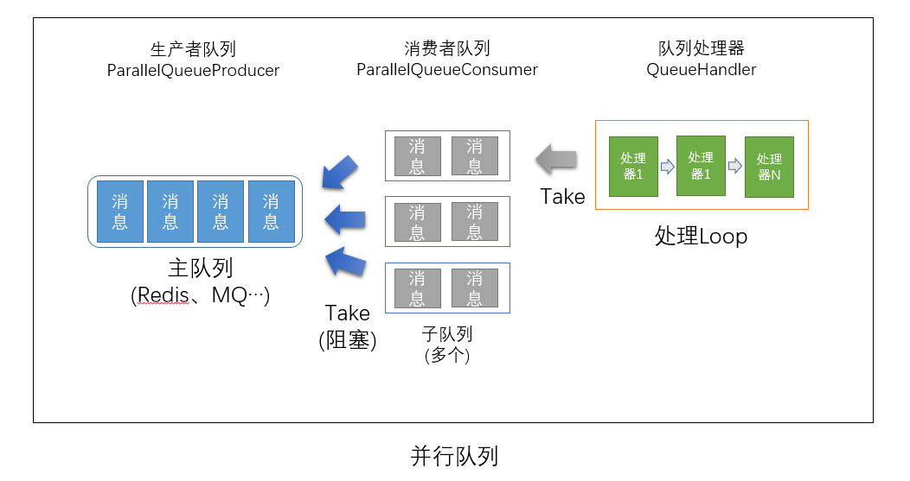

# ASP.NET Core 扩展库

ASP.NET Core扩展库是针对.NET Core常用功能的扩展，包含日志、Token提供器、并行队列处理、HttpClient扩展、轻量级的DTO类型映射等功能。

## 日志扩展

扩展库中，我们对Serilog日志库进行了简单的封装使其更加容易配置，同时也增强了本地文件日志Sink，使其支持更复杂的日志目录结构。

有关日志的详细说明，请参考[日志](./doc/Logging.md)文档

## 轻量级实体映射

在分层设计模式中，各层之间的数据通常通过数据传输对象(DTO)来进行数据的传递，而大多数情况下，各层数据的定义结构大同小异，如何在这些定义结构中相互转换，之前我们通过使用[AutoMapper](http://automapper.org/)库，但**AutoMapper**功能庞大，在很多场景下，可能我们只需要一些基础功能，那么此时你可以选择扩展库中的轻量级AutoMapper实现。

核心功能

- 在使用之前无需手动定义类型之间的映射关系
- 采用动态编译、缓存转换委托，提升性能。
- 支持通过特性定义属性映射关系
- 支持插入自定义的转换处理方法
- 支持列表转换
- 支持嵌套类型转换
- 支持循环引用及引用关系维持
- 支持转换模式或拷贝模式
- 支持生成预定义的拷贝委托
- 为了保持其轻量性，目前支持以下转换
  - 值类型转换
  - 数值类型之间的兼容转换（如int-->uint）
  - 支持值类型与其可空类型间的兼容转换
  - 字典类型转换
  - 列表类型转换
  - 枚举类型与string类型间的转换
  - **不支持**结构体之间的转换以及结构体与类之间的转换

有关轻量级实体映射的详细说明，请参考[轻量级实体映射](./doc/LightweightMapper.md)文档
  
## HttpClient扩展

.NET Core扩展库中通过HttpFactory及HttpClient来执行HTTP请求调用，HttpClient扩展在此基础上进行了更多功能的扩展，增加易用性、可测试性。

HttpClient包含以下功能：

- 针对HttpClient的相关扩展方法
- 针对HttpRequestMessage及HttpResponseMessage的扩展方法
- 请求日志记录
- 请求头的自动传递（请求链路跟踪）
- Http请求模拟（用于测试或模拟第三方服务）
- Http受限请求中，可自动获取及管理访问令牌

## 令牌提供器

令牌提供器用于管理应用的相关访问令牌，主要由HttpClient扩展使用。当然你也可以单独使用。

令牌提供器包含以下功能：

- 认证客户端的管理
- 访问令牌的缓存（支持本地缓存及分布式缓存）
- 访问令牌的自动获取及自动过期处理
- 访问令牌的获取器（即如何从认证服务中获取指定客户端的访问令牌）
- 访问令牌的设置器（即如何在Http请求中设置访问令牌）
- 访问令牌的失效判断器（即如何判断请求令牌失效）

## 并行队列处理

并行队列处理可以将一个大的队列，拆分到多个子队列进行并行处理，以提高处理效率。同时，在每个子队列处理中实现了处理管道，可灵活扩展。
